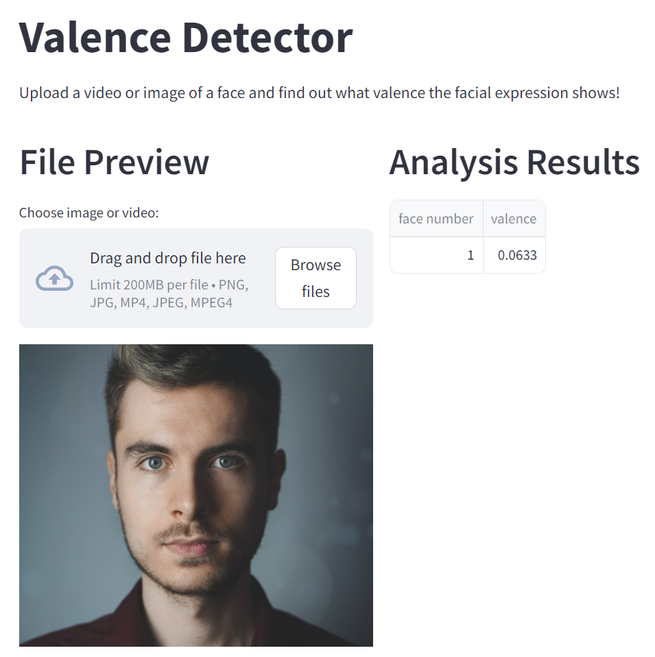

# The Valence Detector

The valence detector can be used to determine the valence of facial expressions in an image or in a video. This is useful, for example, to determine the emotional reaction of a company's customers to its advertising. After an image or video is loaded into the app, it is first checked whether the model can recognize at least one face. If this is not the case, the user is asked to upload another image or video file. If at least one face has been detected, the valence for all recognized faces is determined on a scale from -1 (negative valence) to +1 (positive valence) by a neural network that has been trained using facial images. The results are both displayed directly in the app and automatically downloaded to the project directory.

## Installation

To install the valence detector, ensure you have the following software installed:
- Python 3.11 or higher
- Pip

Download and save all project files to your desired directory. Before launching the valence detector, you need to install the necessary requirements. It is recommended to do this within a virtual environment (refer to https://docs.python.org/3/tutorial/venv.html for an explanation). First, create the virtual environment in your target directory.

```shell
python -m venv your_venv_name
```

Next, activate your newly created virtual environment.

On Windows, execute:
```shell
your_venv_name\Scripts\activate.bat
```

On Unix or MacOS, execute:
```shell
source your_venv_name/bin/activate
```

Now, you can install the project's requirements within the virtual environment.

```shell
pip install -r requirements.txt
```

You are ready to use the valence detector!

## Usage

To launch the valence detector, run the following command within your created and activated virtual environment. 

```shell
streamlit run gui.py
```

Upon starting the valence detector, Streamlit will initialize a local web server on your machine, displaying the valence detector interface (see screenshot). Follow the on-screen instructions within the app to utilize the valence detector. You can use the files in the "media" folder to test the app. 



## View Training Results

The training results of the various models developed for the valence detector project are stored in the "runs" folder. You can view the training results using the following command in your activated virtual environment: 

```shell
tensorboard --logdir=runs
```

To keep the training results organized, the "runs" folder is further divided into specific training phases (e.g., model selection, hyperparameter tuning). Instead of visualizing the results from the entire "runs" folder, you can specify which results to show in TensorBoard, for example:

```shell
tensorboard --logdir=runs\model_selection
```

Note: if you view tensorboard results on Unix or MacOS, replace the backward slash "\\" with the forward slash "/". 

Once TensorBoard is started, you can view the training results in your web browser at http://localhost:6006. 

The model results were obtained by running the Jupyter notebooks included in the project directory. To view them in JupyterLab, run the following command in your virtual environment:

```shell
jupyter lab
```

Before executing the Jupyter notebooks in the specified order, the twelve zip-files of the AFEW-VA dataset need to be downloaded (https://ibug.doc.ic.ac.uk/resources/afew-va-database/) and stored in the "data" folder. To reproduce the original train-test-validation split, the "assigned_folders.json" file in the "data/splits_metadata" directory describes the folder assignments for each data split. 


